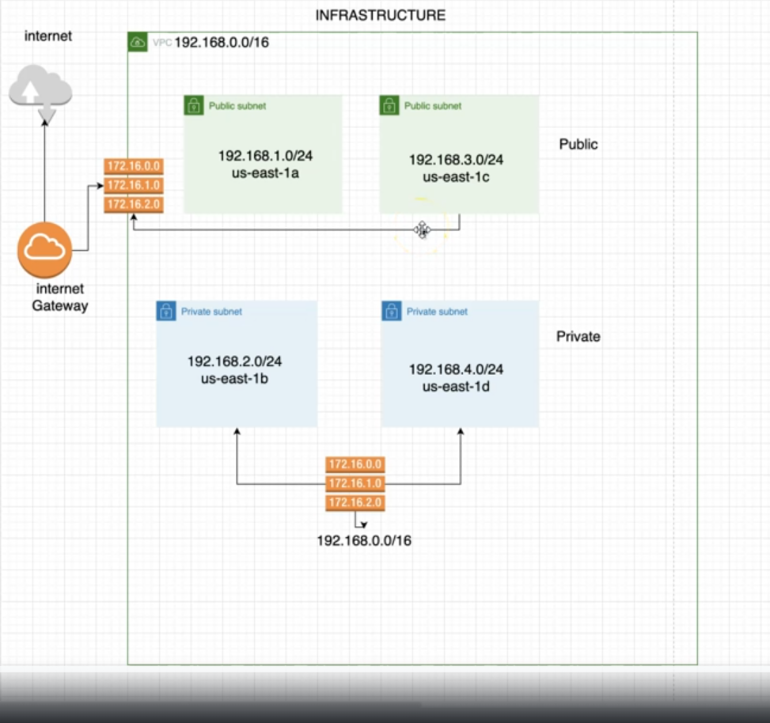

## CUSTOM AWS VPC IaC

### Create custom AWS VPC using Terraform. Infrastructure include:
* AWS VPC
* AWS VPC Subnets(2 private and 2 public)
* Internet Gateway
* AWS Route tables
* AWS Route table associations

## Prerequisites

* **[AWS CLI](https://docs.aws.amazon.com/cli/latest/userguide/getting-started-install.html#getting-started-install-instructions)**
* **[Terraform version 1.4.6](https://developer.hashicorp.com/terraform/install)**
* **AWS Account**
* **AWS IAM User/Profile**

## High Level Diagram


## Instructions to deploy VPC

### Clone repository

```bash
git clone https://github.com/mariuszbrozda/AWS-VPC-Terraform.git

```
### Setup AWS Profile credentials

```bash
aws configure --profile profilename
```
Provide access_key, secret_key and region(exported during IAM user keypair setup)

### Deploy AWS resources

#### Init working directory

```bash
terraform init
```

#### Format and validate configuration

```bash
terraform fmt && terraform validate
```

#### Plan and deploy VPC and subnets

```bash
terraform plan -target=aws_vpc.main_vpc -target=aws_subnet.subnet

terraform apply -target=aws_vpc.main_vpc -target=aws_subnet.subnet
```
#### Plan and apply remaining resources
```bash
terraform plan
terraform apply -auto-approve
```